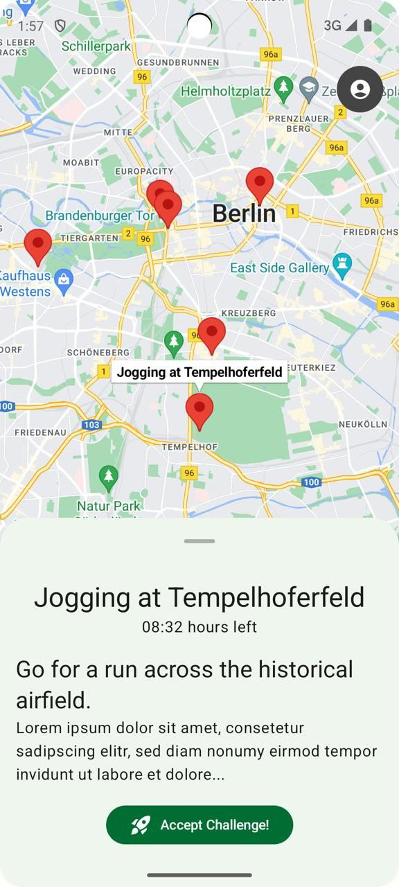

# Le Quest

Le Quest is an App which aims to give you daily challenges in a city of your choice (Berlin in this case). The challenges are supposed to get you out of your comfort zone and to visit new places and meet like-minded people.

This is a Kotlin Multiplatform project targeting Android and iOS.

## Features
- Select a quest of your choice or simply accept the daily challenge suggested by the App.
- Quests are completed by scanning a QR code at the quest's location.
- Collect XP and rank up to higher leves.

## Tech stack
- [Room Kotlin Multiplatform](https://developer.android.com/kotlin/multiplatform/room)  for the database
- [Supabase](https://supabase.com/) for the remote data
- [Compose Multiplatform](https://www.jetbrains.com/compose-multiplatform/) for the UI
  - However native screens are implemented where needed, as for the QR code scanner or the map (e.g., Apple Maps on iOS and Google Maps on Android).
- [Koin](https://insert-koin.io/) dependency injection framework.

## Screenshots

